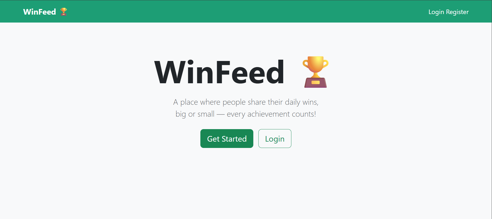
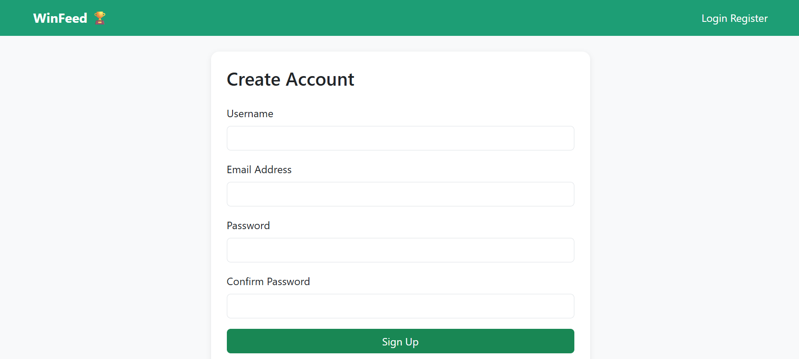
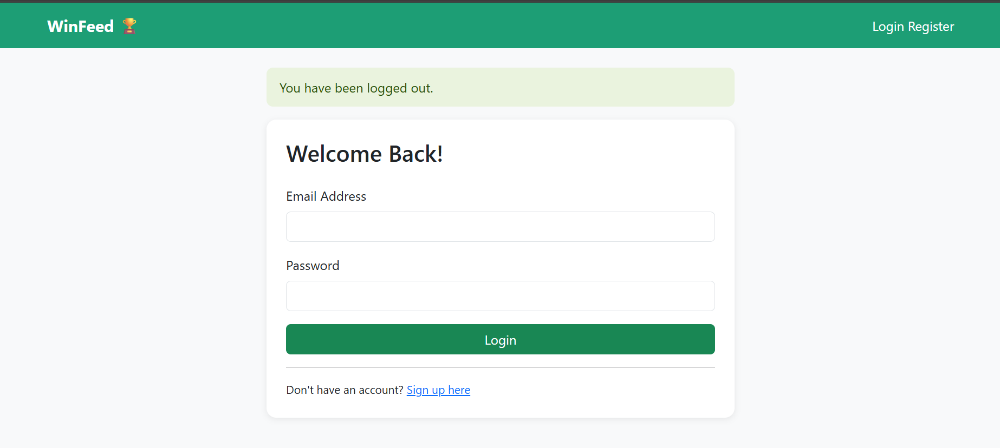
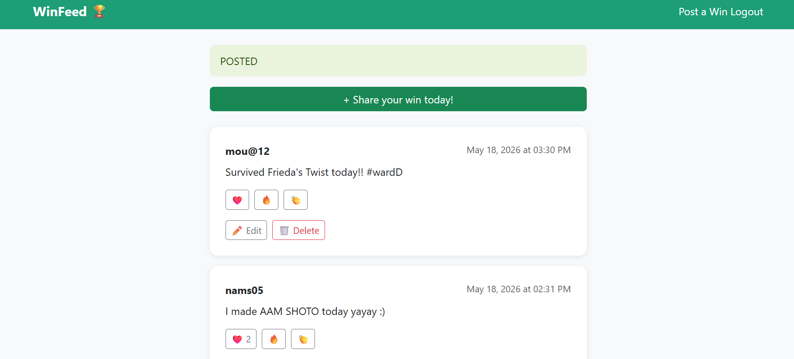
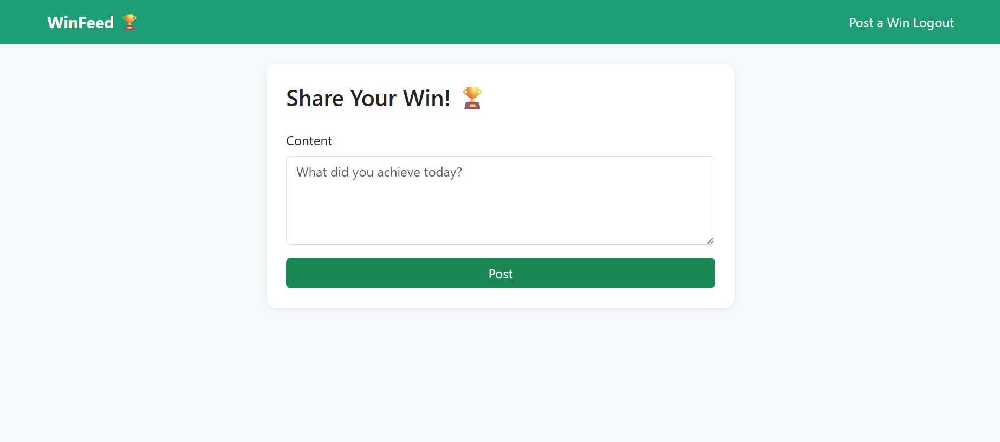

# WinFeed 🏆
> A social platform where people share their daily achievements and wins!

## About The Project
WinFeed is a full-stack(mainly focused on backend) web application built with Flask where users can:
- Share their daily wins and achievements 🎉
- React to other people's posts with ❤️ 🔥 👏
- Edit and delete their own posts
- View other users' profiles

## Built With
- **Python** — Core programming language
- **Flask** — Web framework
- **SQLAlchemy** — Database ORM
- **Flask-Login** — User authentication
- **Flask-WTF** — Form handling and validation
- **SQLite** — Database
- **Bootstrap 5** — Frontend styling

## Features
- ✅ User registration and login system
- ✅ Password hashing for security
- ✅ CSRF protection on all forms
- ✅ Create, update, delete posts
- ✅ React to posts with emojis
- ✅ Responsive design

## Project Structure
winfeed/
├── app/
│   ├── init.py      # App factory and configuration
│   ├── models.py        # Database models
│   ├── routes.py        # URL routes and view functions
│   ├── forms.py         # WTForms form classes
│   ├── templates/       # HTML templates
│   └── static/          # CSS and static files
└── run.py               # Application entry point

## Installation

### 1. Clone the repository
```bash
git clone https://github.com/sanyalankita12/winfeed.git
cd winfeed
```

### 2. Create virtual environment
```bash
python -m venv .venv
.venv\Scripts\activate
```

### 3. Install dependencies
```bash
pip install -r requirements.txt
```

### 4. Run the application
```bash
python run.py
```

### 5. Open in browser

http://127.0.0.1:5000

## Note
This project was built while learning Flask from scratch.
The backend logic (routes, database models, authentication, 
security) was written and understood by me independently.
Frontend templates were kept minimal as the focus of this 
project was backend development with Flask and SQLAlchemy.

Assistance(templates from bootstrap,and AI assistance was used for the templates) was used as a learner to understand
concepts and debug errors.

## What I Learned
- Building a full stack web app with Flask from scratch
- Database design with SQLAlchemy (One-to-Many, relationships)
- User authentication and session management with Flask-Login
- Security best practices (password hashing, CSRF protection)
- REST-like routing and Blueprint organization
- Git and GitHub workflow
- Debugging and problem solving independently

## Author
**Ankita Sanyal**
- GitHub: [@sanyalankita12](https://github.com/sanyalankita12)

---
*Built with a lot of learning and debugging!*

## Screenshots

### Home Page:-


### Register Page:-


### Login Page:-


### Feed page:-


### New Post Page:-

